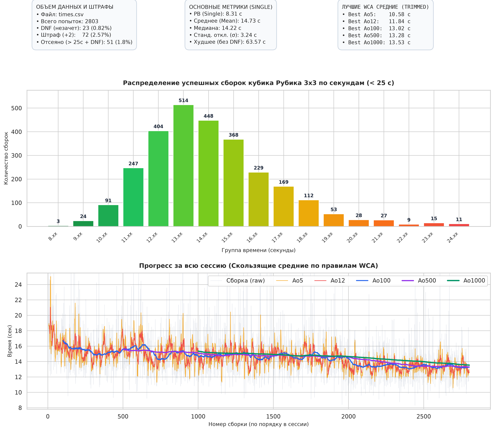

# Speedcubing Session Analytics & Dashboard 🧩

Скрипт на Python для глубокого анализа тренировочных сессий спидкубинга и визуализации прогресса на основе экспорта из **csTimer** (CSV).

Инструмент рассчитывает честные скользящие средние по регламенту **WCA**, отслеживает штрафы, строит градиентную гистограмму распределения и подробный график динамики сессии.

## Основные возможности

* **Поддержка экспорта csTimer:** чтение `.csv` файлов с разделителем `;`, автоматический учет штрафов `+2` и попыток `DNF`.

* **Честный WCA Trimmed Mean:** скользящие средние **Ao5**, **Ao12**, **Ao100**, **Ao500** и **Ao1000** рассчитываются по правилам WCA/csTimer (усечение 1 худшего/лучшего для малых средних и 5% с округлением вверх для больших средних).

* **Корректная обработка DNF:** превышение допустимого лимита DNF в окне честно сбрасывает показатель средней в DNF (без искажения цифр).

* **Информативный дашборд:**

  * Карточки статистики: объем сессии, процент DNF и штрафов, Single PB, Mean, Median, $\sigma$, рекорды средних.

  * Градиентная гистограмма распределения сборок по секундам с точными счетчиками над каждым столбиком.

  * График прогресса сессии со всеми линиями средних.

## Установка

Клонируй репозиторий и установи зависимости:

```
git clone https://github.com/s4ymyn4mee/speedcubing_stats.git
cd speedcubing_stats

# Создание и активация виртуального окружения
python3 -m venv .venv
source .venv/bin/activate

# Установка библиотек
pip install -r requirements.txt

```

## Использование

Помести файл экспорта из csTimer в корень проекта (по умолчанию ищется `times.csv` или любой `.csv` файл).

```
# Стандартный запуск (порог отсечки выбросов по умолчанию: 25 сек)
python3 get_stat.py

# Указать свой порог отсечки для гистограммы 
# Например, чтобы в гистограмме учитывались только сборки, которые <20 секунд, напишите:
python3 get_stat.py 20
# или
python3 get_stat.py --cutoff 20

# Указать конкретный файл и порог
python3 get_stat.py my_session.csv 22

```

После выполнения скрипт выведет сводку в консоль и сохранит результат в `speedcubing_stats.png`.

## Пример дашборда

